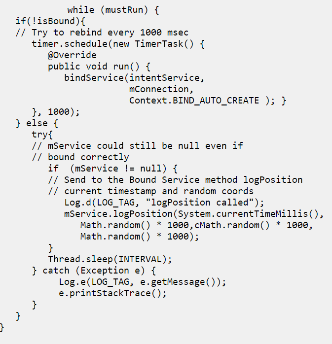
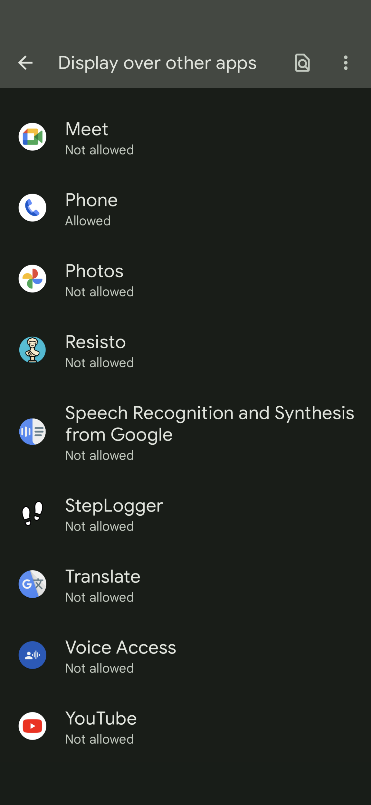
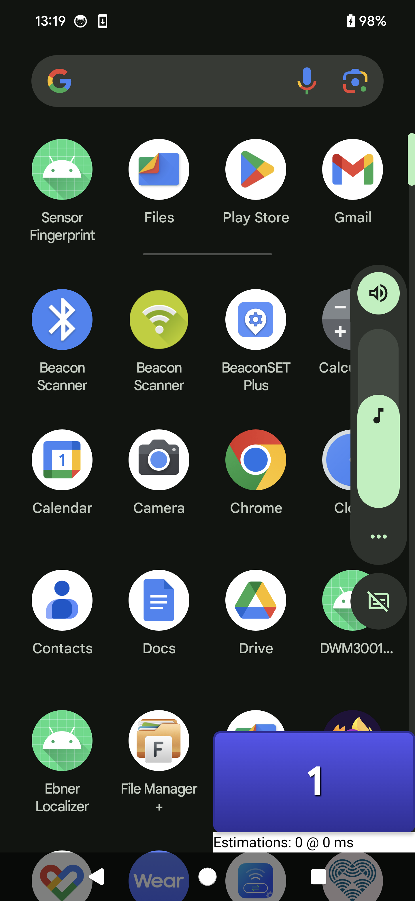
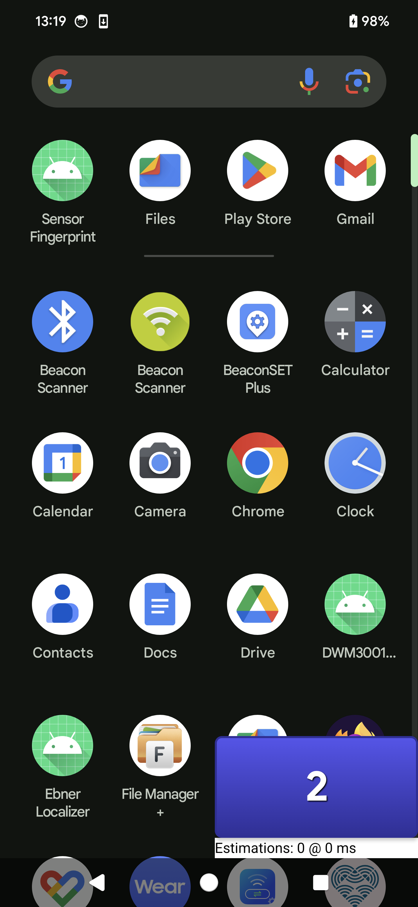

# Onsite Tracks: Requirements for Competitors

**IPIN Competitors are required to develop an Android app designed for smartphones** (no tablets are allowed) that:

- computes the location of the user during the measurement session

- reports the estimated position twice per second to the measurement app (aka the `steplogger` app).

**Remember: Test your localization app + steplogger with a testing path of 15+ minutes in order to ensure the robustness of your localization app.**

This repository includes 4 submodules:
- `steplogger`: An Android app that includes :
    - an overlay-based  GUI that presents buttons users can press to record the current timestamp.
    - a logging service designed to log the positions computed by a competitor app, and to log the timestamps of clicks on the overlay buttons;
- `steplogger_fullscreen`: A variant of `steplogger` that runs as a full-screen app (buttons are full-screen instead of small overlays).
- `steplogger_client`: An Android test app that generates fake positions and invokes the logging system of `steplogger`/`steplogger_fullscreen`.
- `evaalscore`: The octave/matlab code used to evaluate competitor apps.

**To clone this repo with all submodules run command**
```
    git clone --recursive https://github.com/wnlab-isti/IPIN-competition_track1.git
```

Installing and testing `steplogger_client` + `steplogger` will allow you to reproduce the setup we will use during the IPIN competition.

## The AIDL logging interface

Here we describe the mechanism that a competitor app will use to communicate with `steplogger`.

`steplogger` implements and exports a simple service, with the following Java-method API:
```
    void logPosition(in long timestamp, in double x,in double y, in double z);
```

This method must be invoked through the [AIDL](https://developer.android.com/guide/components/aidl) interface. 
In particular, competitors are required to add the `steplogger` AIDL file to their Android project and invoke the `logPosition` method **twice per second** in order to log the estimated position with a frequency of 2Hz.

Every time the `logPosition` method is invoked, steplogger logs the following information:

- Timestamp: time in milliseconds from the Unix epoch, as returned from calling the Java method `System.currentTimeMillis()`;
- Coordinates `x, y, z` : `x` and `y` are longitude and latitude, respectively, in the WGS84 reference system, while `z` is the floor, that is an integer number, with 0 indicating the ground floor.

`steplogger` saves this information in file `positions.log`, as detailed below in Section: [steplogger logging mechanism](#steplogger-logging-mechanism) 

### How to use the AIDL logging interface
Access the steplogger submodule and copy the AIDL interface file (/app/src/main/aidl/it/cnr/isti/steplogger/IsteploggerService.aidl) in the `aidl` folder of your Android project


- Add the AIDL file under the Java package: `it.cnr.isti.steplogger`
- If your app is built with API Level 30 and above, declare that you're using the steploggerService in your `AndroidManifest.xml`:

```
        <queries>
            <package android:name="it.cnr.isti.steplogger" />
        </queries>
```
- Invoke the `logPosition()` method by following these steps:
    - Create an Intent object
    - Set the class name of the intent object with:
```
        BOUNDSERVICE_PACKAGE = "it.cnr.isti.steplogger";
        BOUNDSERVICE_CLASS = ".steploggerService";
```

- Invoke the `bindService(…)` method provided by the Android OS in order to bind to the service that matches the above `BOUNDSERVICE_PACKAGE` and `BOUNDSERVICE_CLASS`
```
        void bindService(in Intent intentService, in ServiceConnection mConnection, in int flags);
```

Now you can test the interaction between `steplogger_client` and `steplogger`:

- Start the `steplogger_client` app. This app provides an **example** of how the competing app should interact with the `steplogger` app. `steplogger_client` shows a GUI with two buttons: `START LOGGING POSITION` and `STOP LOGGING POSITION`.
These buttons allow you to start and stop a logging session.


When you click `START LOGGING POSITION`:
- The `StepLoggerClientActivity` creates an intent object and it sends it to the `StepLoggerClientService`
- The `StepLoggerClientService` manages the intent received with the following steps:
    - It creates an intent for invoking the `logPosition` service:
```
        intentService.setClassName(BOUNDSERVICE_PACKAGE, BOUNDSERVICE_PACKAGE + BOUNDSERVICE_CLASS);
```

    - It binds to the service with the Android call:
```
        bindService(intentService, mConnection , Context.BIND_AUTO_CREATE);
```

    - It invokes method `logPosition()` twice per second, with randomly generated x, y, and z coordiantes.



## steplogger and steplogger_fullscreen

- `steplogger` is a simple GUI app that displays a button as an overlay that takes only a small portion of the device screen so it can be displayed on top of other apps (i.e., the competitor app). 

- `steplogger_fullscreen` works the same as `steplogger` but does not run as an overlay on top of other apps. 
The app shows a full screen button.

During the competition a competitor will walk along a predefined path within the evaluation site.
Along the path several markers, each with a different label, will be placed on the floor.
The competitor is supposed to press the button shown dy `steplogger` whenever he/she walks over one of the markers.
The label on the button changes with clicks and reminds the competitor which is the next marker to be encountered along the path.
In other words the competitor will press the button with label X as soon as he/she walks over the correspondingly labeled marker X.

Every time the button is pressed, `steplogger` logs the following information:

- Timestamp: this time is gathered from the smartphone clock 
- The current button label

This information is stored in file `buttonsPressed.log`: please refer to the [steplogger Logging mechanism](#steplogger-logging-mechanism) section for information about the logs.

### How to start a new measurement session

**FIRST**: copy the the [INI](resources/it.cnr.isti.steplogger.config.ini) file under the Download directory of your phone.

- Install `steplogger` and `steplogger_client` apps. 
If you plan to upload the `.apk` files on your smartphone and install them manually, remember to enable installation from unknown sources in you smartphones, otherwise the installation will fail. 
Moreover, new versions of Android OS require you to allow running apps in overlay mode as shown in the follwing screenshot (italian language). Click on `install anyway` button:


At this point, Android will show you a list of all apps allowed to run in overlay mode; look for `steplogger` and enable it, as well:




- Look for `steplogger` and `steplogger_client` apps on your smartphone
- Move `steplogger` and `steplogger_client` on the Home page screen
- Run `steplogger_client` and click on button: `START LOGGING POSITION`
- Run `steplogger` and start a new measurement session:







- `steplogger` updates the logs as soon as you press the button. When you switch to another app and then reopen `steplogger`, it resumes from the last button pressed.
- After stepping over all the markers, `steplogger` finalizes the log files and shows a white screen

Some options are available on the top-right menu:


- Settings are available on the top-right menu, it allows to switch to test mode. In test mode `steplogger` does not log any file. 
Test mode should be off during the measurement session

-------Concerning steplogger `(overlay)`, all the previous steps are the same. The GUI is slightly different:


### steplogger Logging mechanism
`steplogger` writes the logs generated during the measurement session to the `Download` directory of the devices running `steplogger`. Inside the `Download` directory, `steplogger` archives the log files in the folder named: `it.cnr.isti.steplogger`. For example the full path of the smartphone used for tests is:

	storage/sdcard0/Download/it.cnr.isti.steplogger/

Within the folder `it.cnr.isti.steplogger/` `steplogger` creates a folder for every measurement session, the logs are placed in folder whose name follows this convention:

	[YearMonthDay]T[HourMinutesSeconds][Competitor ID]

The following image shows an example of the names assigned to the folders for the measurement sessions.


Every folder contains the logs of the measurement session(s) related to the `Competitor ID`. For every measurement session `steplogger` creates two files:

- `buttonsPressed.log`: logs the time stamp and the label of the button pressed
- `positions.log`: logs the time stamp and the position (x,y,z) notified by the app of the competitors

[Example of logs to download](resources/logs.zip)


- Code your localization app so that it is possibile to :
	- halt the system
	- stop invoking the AIDL interface

 
For any question that might be potentially of interest for all the competitors use the mailing list: <contest@evaal.aaloa.org>
